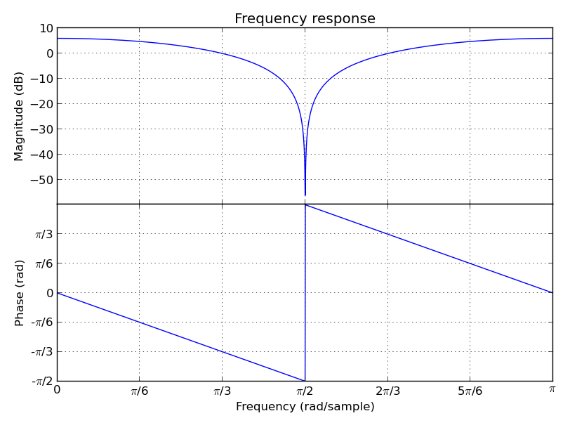
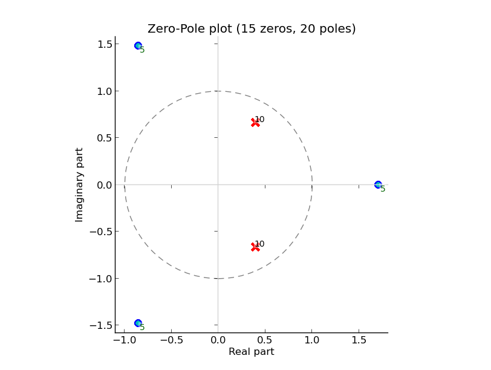
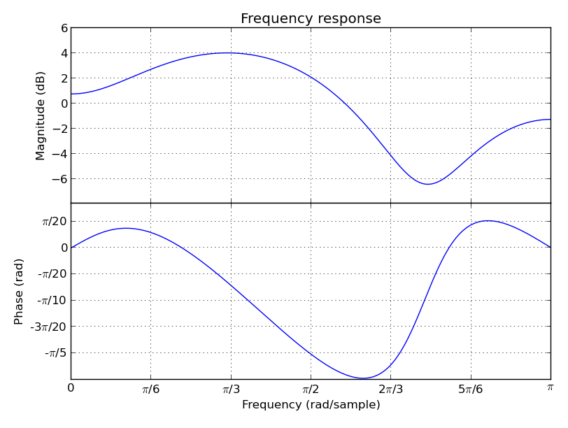
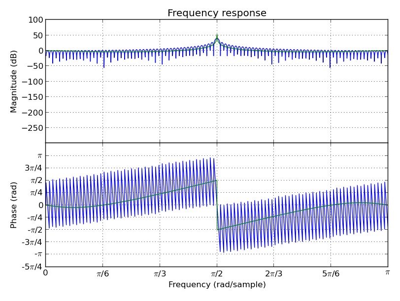

..
  This file is part of AudioLazy, the signal processing Python package.
  Copyright (C) 2012-2013 Danilo de Jesus da Silva Bellini

  AudioLazy is free software: you can redistribute it and/or modify
  it under the terms of the GNU General Public License as published by
  the Free Software Foundation, version 3 of the License.

  This program is distributed in the hope that it will be useful,
  but WITHOUT ANY WARRANTY; without even the implied warranty of
  MERCHANTABILITY or FITNESS FOR A PARTICULAR PURPOSE. See the
  GNU General Public License for more details.

  You should have received a copy of the GNU General Public License
  along with this program. If not, see <http://www.gnu.org/licenses/>.

  danilo [dot] bellini [at] gmail [dot] com

AudioLazy
=========

Real-Time Expressive Digital Signal Processing (DSP) Package for Python!

Laziness and object representation
----------------------------------

There are several tools and packages that let the Python use and
expressiveness look like languages such as MatLab and Octave. However, the
eager evaluation done by most of these tools make it difficult, perhaps
impossible, to use them for real time audio processing. To avoid such
eagerness, one can make the calculations only when data is requested, not
when the path to the data is given. This is the core idea in laziness that
allows:

- Real-time application (you don't need to wait until all data is
  processed to have a result);
- Endless data sequence representation;
- Data-flow representation;
- Task elimination when a reverse task is done: instead of doing something
  to then undo, nothing needs to be done, and no conscious optimization
  need to be done for that.

Another difficulty concerns expressive code creation for audio processing in
blocks through indexes and vectors. Sometimes, that's unavoidable, or at
least such avoidance would limit the power of the system that works with
sequence data.

Block sequences can be found from sample sequences being both objects, where
the latter can be the result of a method or function over the former. The
information needed for such is the block size and where would start the next
block. Although one can think about the last block and the exact index where
it would start, most of the time spent in steps like this one happens to be
an implementation issue that just keep the focus away from the problem being
worked on. To allow a thing like an endless data sequence, there should be
no need to know when something stops.

Probably an engineer would find the use of equations and structures from
electrical engineering theory much cleaner to understand than storing
everything into data arrays, mainly when common operations are done to these
representations. What is the product of the filter with numerator
``[1, 7, 2]`` and denominator ``[1, 0.5, 0.2]`` as its system equation with
the one that has the arrays reversed like ``[2, 7, 1]``? That might be simple,
and the reversed would avoid questions like "what comes first, the zero or the
[minus] two exponent?", but maybe we could get more efficient ourselves if we
had something easier: multiplication could be written once and for all and
with a representation programmers are used to see. This would be even more
expressive if we could get rid from the asymmetry of a method call like
``filt1.multiply_by(filt2)``, since multiplication in this case should be
commutative. The use of natural operators is possible in a language that
allows operator overloading, but for such we need to describe
those equations and structures as objects and object relationships.

The name ``Hz`` can be a number that would allow conversion to a default DSP
internal rad/samples unit, so one can write things like ``freq = 440 * Hz``.
This isn't difficult in probably any language, but can help in expressiveness,
already. If (almost) everything would need data in "samples" or "rad/sample"
units, constants for converting these from "second" and "hertz" would help
with the code expressiveness. A comb filter ``comb.tau(delay=30*s, tau=40*s)``
can represent a comb filter with the given delay and time constant, both in
samples, but with a more clear meaning for the reader than it would have with
an expression like ``[1] + [0] * 239999 + [alpha]``. Would it be needed to
store all those zeros while just using the filter to get a frequency response
plot?

It's possible to avoid some of these problems with well-chosen constants,
duck typing, overloaded operators, functions as first-class citizens, object
oriented together with functional style programming, etc.., resources
that the Python language gives us for free.

What does it do?
----------------

Prioritizing code expressiveness, clarity and simplicity, without precluding
the lazy evaluation, and aiming to be used together with Numpy, Scipy and
Matplotlib as well as default Python structures like lists and generators,
AudioLazy is a package written in pure Python proposing digital audio signal
processing (DSP), featuring:

- A ``Stream`` class for finite and endless signals representation with
  elementwise operators (auto-broadcast with non-iterables) in a common
  Python iterable container accepting heterogeneous data;
- Strongly sample-based representation (Stream class) with easy conversion
  to block representation using the ``Stream.blocks(size, hop)`` method;
- Sample-based interactive processing with ``ControlStream``;
- ``Streamix`` mixer for iterables given their starting time deltas;
- Multi-thread audio I/O integration with PyAudio;
- Linear filtering with Z-transform filters directly as equations (e.g.
  ``filt = 1 / (1 - .3 * z ** -1)``), including linear time variant filters
  (i.e., the ``a`` in ``a * z ** k`` can be a Stream instance), cascade
  filters (behaves as a list of filters), resonators, etc.. Each
  ``LinearFilter`` instance is compiled just in time when called;
- Zeros and poles plots and frequency response plotting integration with
  MatPlotLib;
- Linear Predictive Coding (LPC) directly to ``ZFilter`` instances, from
  which you can find PARCOR coeffs and LSFs;
- Both sample-based (e.g., zero-cross rate, envelope, moving average,
  clipping, unwrapping) and block-based (e.g., window functions, DFT,
  autocorrelation, lag matrix) analysis and processing tools;
- A simple synthesizer (Table lookup, Karplus-Strong) with processing tools
  (Linear ADSR envelope, fade in/out, fixed duration line stream) and basic
  wave data generation (sinusoid, white noise, impulse);
- Biological auditory periphery modeling (ERB and gammatone filter models);
- Multiple implementation organization as ``StrategyDict`` instances:
  callable dictionaries that allows the same name to have several different
  implementations (e.g. ``erb``, ``gammatone``, ``lowpass``, ``resonator``,
  ``lpc``, ``window``);
- Converters among MIDI pitch numbers, strings like "F#4" and frequencies;
- Polynomials, Stream-based functions from itertools, math, cmath, and more!
  Go try yourself! =)

Installing
----------

The package works both on Linux and on Windows. You can find the last stable
version at `PyPI <http://pypi.python.org/pypi/audiolazy>`_ and install it with
the usual Python installing mechanism::

  python setup.py install

If you have pip, you can go directly (use ``-U`` for update or reinstall)::

  pip install audiolazy

for downloading (from PyPI) and installing the package for you, or::

  pip install -U .

To install from a path that has the ``setup.py`` file and the package data
uncompressed previously.

For the *bleeding-edge* version, you can install directly from the github
repository (requires ``git`` for cloning)::

  pip install -U git+git://github.com/danilobellini/audiolazy.git

For older versions, you can install from the PyPI link or directly from the
github repository, based on the repository tags. For example, to install the
version 0.04 (requires ``git`` for cloning)::

  pip install -U git+git://github.com/danilobellini/audiolazy.git@v0.04

The package doesn't have any strong dependency for its core besides the Python
itself (versions 2.7, 3.2 or newer) as well as its standard library, but you
might need:

- PyAudio: needed for playing and recording audio (``AudioIO`` class);
- NumPy: needed for doing some maths, such as finding the LSFs from a filter
  or roots from a polynomial;
- MatPlotLib: needed for all default plotting, like in ``LinearFilter.plot``
  method and several examples;
- SciPy (testing and examples only): used as an oracle for LTI filter testing
  and for the Butterworth filter example;
- pytest, pytest-cov and pytest-timeout (testing only): runs test suite and
  shows code coverage status;
- wxPython (example only): used by one example with FM synthesis in an
  interactive GUI;
- Tkinter (example only): needed for the pitch follower based on the
  zero-crossing rate example GUI;
- Music21 (example only): there's one example that gets the Bach chorals from
  that package corpora for synthesizing and playing;
- Sphinx (documentation only): it can create the software documentation in
  several different file formats.

Beside examples and tests, only the filter plotting with ``plot`` and
``zplot`` methods needs MatPlotLib. Also, the routines that needs NumPy up to
now are:

- Root finding with ``zeros`` and ``poles`` properties (filter classes) or
  with ``roots`` property (Poly class);
- Some Linear Predictive Coding (``lpc``) strategies: ``nautocor``,
  ``autocor`` and ``covar``;
- Line Spectral Frequencies ``lsf`` and ``lsf_stable`` functions.

Getting started
---------------

Before all examples below, it's easier to get everything from audiolazy
namespace:

.. code-block:: python

  from audiolazy import *

All modules starts with "lazy\_", but their data is already loaded in the main
namespace. These two lines of code do the same thing:

.. code-block:: python

  from audiolazy.lazy_stream import Stream
  from audiolazy import Stream

Endless iterables with operators (be careful with loops through an endless
iterator!):

.. code-block:: python

  >>> a = Stream(2, -2, -1) # Periodic
  >>> b = Stream(3, 7, 5, 4) # Periodic
  >>> c = a + b # Elementwise sum, periodic
  >>> c.take(15) # First 15 elements from the Stream object
  [5, 5, 4, 6, 1, 6, 7, 2, 2, 9, 3, 3, 5, 5, 4]

And also finite iterators (you can think on any Stream as a generator with
elementwise operators):

.. code-block:: python

  >>> a = Stream([1, 2, 3, 2, 1]) # Finite, since it's a cast from an iterable
  >>> b = Stream(3, 7, 5, 4) # Periodic
  >>> c = a + b # Elementwise sum, finite
  >>> list(c)
  [4, 9, 8, 6, 4]

LTI Filtering from system equations (Z-transform). After this, try summing,
composing, multiplying ZFilter objects:

.. code-block:: python

  >>> filt = 1 - z ** -1 # Diff between a sample and the previous one
  >>> filt
  1 - z^-1
  >>> data = filt([.1, .2, .4, .3, .2, -.1, -.3, -.2]) # Past memory has 0.0
  >>> data # This should have internally [.1, .1, .2, -.1, -.1, -.3, -.2, .1]
  <audiolazy.lazy_stream.Stream object at ...>
  >>> data *= 10 # Elementwise gain
  >>> [int(round(x)) for x in data] # Streams are iterables
  [1, 1, 2, -1, -1, -3, -2, 1]
  >>> data_int = filt([1, 2, 4, 3, 2, -1, -3, -2], zero=0) # Now zero is int
  >>> list(data_int)
  [1, 1, 2, -1, -1, -3, -2, 1]

LTI Filter frequency response plot (needs MatPlotLib):

.. code-block:: python

  (1 + z ** -2).plot().show()

The ``matplotlib.figure.Figure.show`` method won't work unless you're
using a newer version of MatPlotLib (works on MatPlotLib 1.2.0), but you still
can save the above plot directly to a PDF, PNG, etc. with older versions
(e.g. MatPlotLib 1.0.1):

.. code-block:: python

  (1 + z ** -2).plot().savefig("my_plot.pdf")

On the other hand, you can always show the figure using MatPlotLib directly:

.. code-block:: python

  from matplotlib import pyplot as plt # Or "import pylab as plt"
  filt = 1 + z ** -2
  fig1 = filt.plot(plt.figure()) # Argument not needed on the first figure
  fig2 = filt.zplot(plt.figure()) # The argument ensures a new figure
  plt.show()

CascadeFilter instances and ParallelFilter instances are lists of filters with
the same operator behavior as a list, and also works for plotting linear
filters. Constructors accepts both a filter and an iterable with filters.
For example, a zeros and poles plot (needs MatPlotLib):

.. code-block:: python

  filt1 = CascadeFilter(0.2 - z ** -3) # 3 zeros
  filt2 = CascadeFilter(1 / (1 -.8 * z ** -1 + .6 * z ** -2)) # 2 poles
  # Here __add__ concatenates and __mul__ by an integer make reference copies
  filt = (filt1 * 5 + filt2 * 10) # 15 zeros and 20 poles
  filt.zplot().show()

Linear Predictive Coding (LPC) autocorrelation method analysis filter
frequency response plot (needs MatPlotLib):

.. code-block:: python

  lpc([1, -2, 3, -4, -3, 2, -3, 2, 1], order=3).plot().show()

Linear Predictive Coding covariance method analysis and synthesis filter,
followed by the frequency response plot together with block data DFT
(MatPlotLib):

.. code-block:: python

  >>> data = Stream(-1., 0., 1., 0.) # Periodic
  >>> blk = data.take(200)
  >>> analysis_filt = lpc.covar(blk, 4)
  >>> analysis_filt
  1 + 0.5 * z^-2 - 0.5 * z^-4
  >>> residual = list(analysis_filt(blk))
  >>> residual[:10]
  [-1.0, 0.0, 0.5, 0.0, 0.0, 0.0, 0.0, 0.0, 0.0, 0.0]
  >>> synth_filt = 1 / analysis_filt
  >>> synth_filt(residual).take(10)
  [-1.0, 0.0, 1.0, 0.0, -1.0, 0.0, 1.0, 0.0, -1.0, 0.0]
  >>> amplified_blk = list(Stream(blk) * -200) # For alignment w/ DFT
  >>> synth_filt.plot(blk=amplified_blk).show()

AudioLazy doesn't need any audio card to process audio, but needs PyAudio to
play some sound:

.. code-block:: python

  rate = 44100 # Sampling rate, in samples/second
  s, Hz = sHz(rate) # Seconds and hertz
  ms = 1e-3 * s
  note1 = karplus_strong(440 * Hz) # Pluck "digitar" synth
  note2 = zeros(300 * ms).append(karplus_strong(880 * Hz))
  notes = (note1 + note2) * .5
  sound = notes.take(int(2 * s)) # 2 seconds of a Karplus-Strong note
  with AudioIO(True) as player: # True means "wait for all sounds to stop"
    player.play(sound, rate=rate)

See also the docstrings and the "examples" directory at the github repository
for more help. Also, the huge test suite might help you understanding how the
package works and how to use it.

----

Copyright (C) 2012-2013 Danilo de Jesus da Silva Bellini

License is GPLv3. See COPYING.txt for more details.
